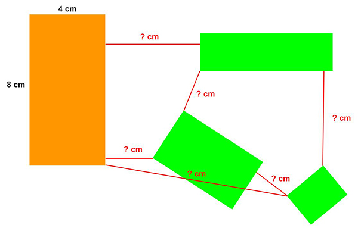
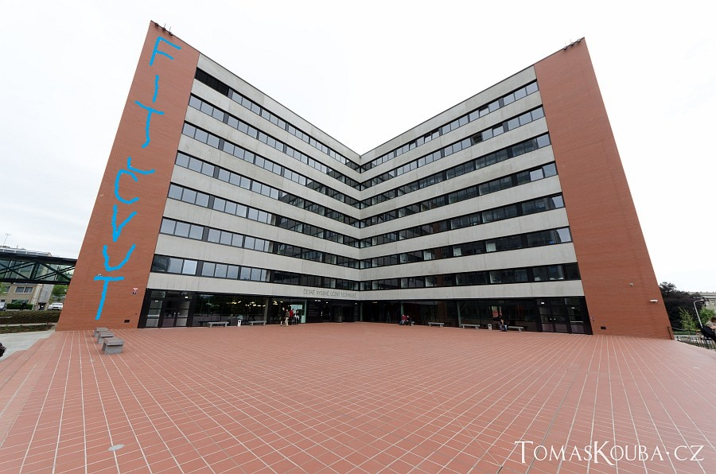
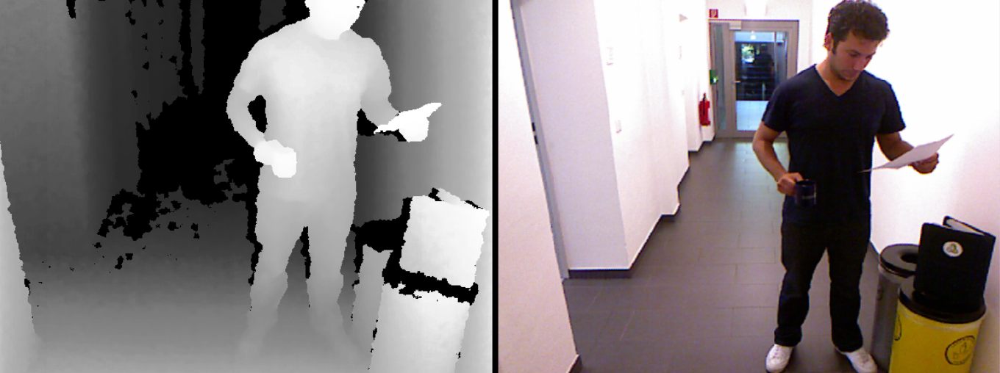
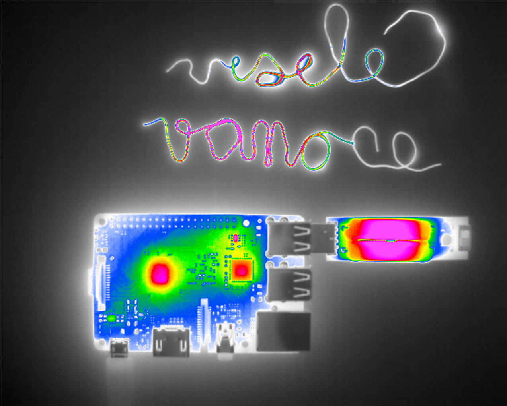

# Computer-Vision-Basics
There is a repository that contains my first computer vision projects using the OpenCV library, which I developed during my studies at FIT CTU. These projects demonstrate that I have a solid theoretical understanding in the field of computer vision. Using OpenCV, I have tackled image processing tasks such as filtering, morphology, geometric transformations, segmentation, and more. This repository also includes work with images from depth and thermal cameras. For easier development of these projects, I have decided to use **improutils** - a package with facilitating and useful functions related to image processing.

## Projects
- [Segmentation basics](#Segmentation-basics)
- [Perspective transform](#Perspective-transform)
- [Depth sensor](#Depth-sensor)
- [Thermal camera](#Thermal-camera)

## Segmentation basics
The goal of this task is to implement the **calculation of the shortest distance between rectangles** on a given source image.

## Perspective transform
This project consists of two parts: 

In the first part, it is necessary to **geometrically transform** the image into a perpendicular view and then recognize the text written on the image using **OCR** tools. 

The goal of the second task is to place the logo image on the building's wall, also using perspective transformation (see image).

## Depth sensor
This task focuses on utilizing data from a depth sensor for **measuring a person's BMI**.

## Thermal camera
This task focuses on utilizing a combination of data from a regular RGB camera and a thermal camera for measuring the size of a heated component.

`Copyright (c) Dmytro Borovko 2024`